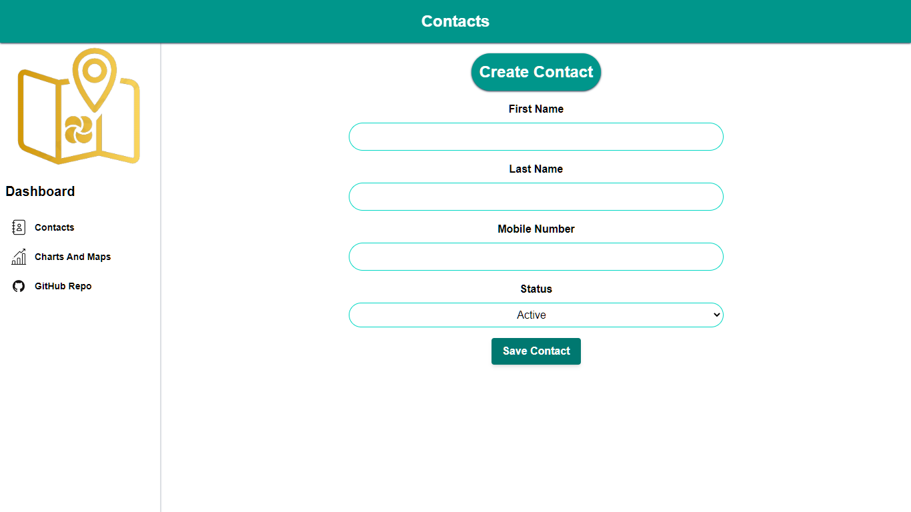
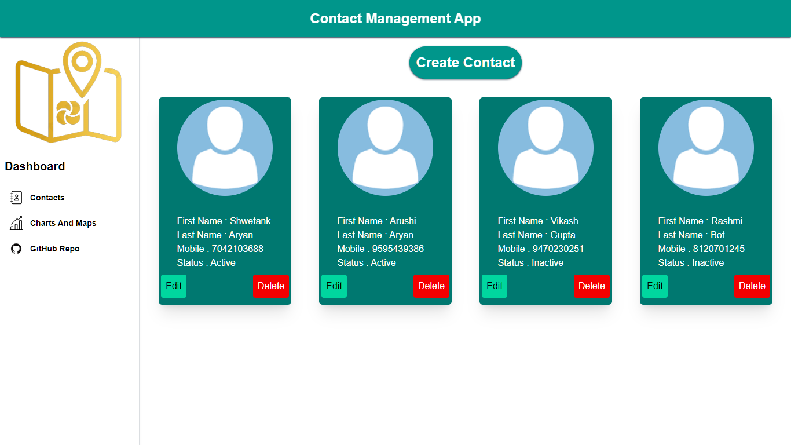
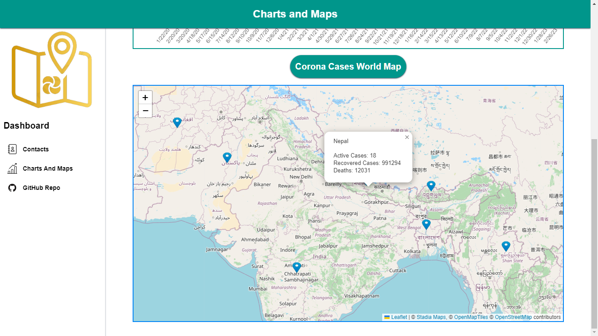

<h1>CovidConnectPlus</h1>

<h1>A Contact Management App with Charts and Maps of Covid Cases all over the World.  
<h1>What is the task assigned by Taiyo.AI ?</h1>
<ul>
<li>Create a Contact Management app with Charts and Maps using ReactJS, TypeScript,
TailwindCSS, React Router v6 and React Query aka TanstackQuery</li>
<li>Create a GitHub/GitLab repo and possibly deploy your app on free services like Vercel, Github
Pages or Heroku etc</li>
</ul>
<h1>Objectives of Contact Page</h1>
<ul>
    <li>The app should have a form for adding new contacts.
    </li>
    <li>The app should display a list of all added contacts</li>
    <li>
    Each contact should have a button to view the contacts details
    </li>
    <li>
    The app should be able to edit and delete contacts
    </li>
    <li>
    Make use of Redux to store the contact data
    </li>
    
</ul>
<h1>Objectives of Charts and Maps Page</h1>
<ul>
    <li>Build a simple dashboard with:
    </li>
    <li>- A line graph showing the cases fluctuations</li>
    <li>
    - A react leaflet map with markers that indicates the country name, total number
    of active, recovered cases and deaths in that particular country as a popup
    </li> 
</ul>

<h1>APIs Used</h1>
<ul>
    <li>World wide data of cases: https://disease.sh/v3/covid-19/all
    </li>
    <li>Country Specific data of cases: https://disease.sh/v3/covid-19/countries</li>
    <li>
   Graph data for cases with date: https://disease.sh/v3/covid-19/historical/all?lastdays=all
    </li> 
</ul>

<h1>Technologies Used</h1>
<ul>
    <li>ReactJs
    </li>
    <li>TypeScript</li>
    <li>
  TailwindCSS
    </li> 
    <li>React Router v6
    </li>
    <li>React Query</li>
    <li>
    Redux
    </li> 
</ul>

<h1><strong> Development Installation </strong></h1>

Follow these instructions to set up your development environment, which you need to do before you start contributing code to this project.

<h1><strong> Manual Installation </strong></h1>

_Note_: The installation steps assume you are using a Unix-like shell. If you are using Windows, you will need to use `copy` instead of `cp`.

1. Install Node.js. The recommended way is to Node through [nvm](https://github.com/nvm-sh/nvm). You can also install [node.js](https://nodejs.org/download/release/v18.2.0/) version 18.2.0 directly from the Node.js website.
2. [Clone](https://github.com/aayanlobo/CovidConnectPlus.git) your new fork of the repository from GitHub onto your local computer.

   ```
   $ git clone https://github.com/aayanlobo/CovidConnectPlus.git
   ```
3. Navigate to root directory and implement the following commands :

   ```
   $ cd CovidConnectPlus
   $ npm install
   $ npm run start
   ```

# Links

- [GitHub Repository](https://github.com/aayanlobo/CovidConnectPlus.git)
- [Deployed Project](https://covid-connect-plus.vercel.app/)


# Showcase
|          |               |
| :--------------------------------------------------: | :-----------------------------------------------------: |
|  |  |
# contact-management

